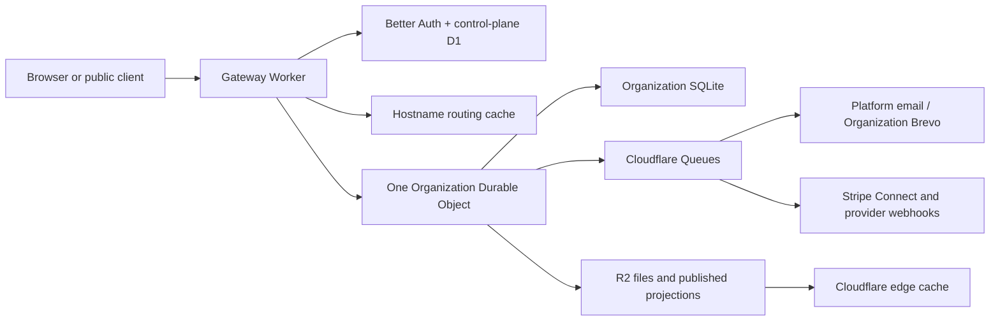

# Cloudflare Multitenant Rebuild Plan

**Status:** Approved architecture; ready to seed the new repository **Parity baseline:**
`choir-management-tool` commit `6874d43a3c3698ae53218a44d17649bc454ca9ac` **Target repository:**
`choir-management-cloudflare` **Production rule:** Internal milestones may be deployed to staging,
but production does not launch until the complete parity matrix passes.

## Objective

Rebuild the application as a greenfield, multi-Organization Cloudflare application. Preserve the
current product's complete behavior, visual character, accessibility, responsive behavior, exports,
public experiences, and operational automation without preserving PocketBase implementation details,
frontend source, or existing data.

The result is a free platform with invitation-only access, one Organization at a time, strong tenant
isolation, delegated Platform Administration, customer-owned payment and communications accounts,
canonical Organization subdomains, optional custom public domains including supported apex
configurations, and a portable export.

## Source of Truth

Use evidence in this order:

1. Executable code and tests at the Parity Baseline establish implemented behavior.
2. Non-PocketBase rules in `AGENTS.md` remain normative, especially domain terminology,
   accessibility, semantic theming, network bounds, TypeScript safety, and algorithmic complexity.
3. `CONTEXT.md` and accepted ADRs define the new product language and architecture.
4. Existing plans and designs provide intent and acceptance detail, but a proposed or superseded
   document does not prove that a feature belongs to parity.

The legacy repository is read-only after the baseline is pinned. The new repository may inspect it
locally through the Parity Bridge, but builds, tests, CI, staging, production, and runtime must
stand alone.

## File Responsibility Map

The initial repository scaffold owns these exact files. Each feature milestone must add its exact
new files to this map before implementation and must verify every listed file before declaring the
milestone complete.

| Path                                                                     | Responsibility                                                                                                                                     |
| ------------------------------------------------------------------------ | -------------------------------------------------------------------------------------------------------------------------------------------------- |
| `AGENTS.md`                                                              | Cloudflare-specific engineering rules plus carried-forward domain and frontend rules                                                               |
| `CONTEXT.md`                                                             | Copied and maintained ubiquitous language                                                                                                          |
| `docs/adr/0016-use-on-break-in-product-language.md`                      | Product language for the user-facing On Break Profile Status and internal Idle representation                                                      |
| `docs/adr/0017-linked-rehearsal-attendance-confirms-performance-rsvp.md` | Linked rehearsal attendance reconciliation to the parent Performance RSVP                                                                          |
| `docs/adr/0018-future-performance-rsvp-restores-active-status.md`        | Automatic Profile Status recovery from a future Performance RSVP Yes                                                                               |
| `docs/adr/0019-use-a-time-based-on-break-timeout.md`                     | Independent time-based On Break to Inactive rule                                                                                                   |
| `docs/adr/0020-roll-out-rsvp-expiry-with-existing-org-review.md`         | Default RSVP Expiry rollout and Organization review posture                                                                                        |
| `docs/adr/0021-keep-manual-status-as-explicit-opt-out.md`                | Per-Profile manual status control as an explicit automation opt-out                                                                                |
| `docs/adr/0022-keep-rsvp-expiry-silent.md`                               | RSVP Expiry conversion without sending a new notification                                                                                          |
| `docs/adr/0023-exclude-archived-and-canceled-performances.md`            | Exclusion boundary for archived or canceled Performances in roster automation                                                                      |
| `docs/adr/0024-evaluate-performance-misses-after-event-end.md`           | Performance miss evaluation only after the Performance has ended                                                                                   |
| `docs/adr/0025-separate-rsvp-and-profile-status-histories.md`            | Separate Event RSVP History and Profile Status History ledgers                                                                                     |
| `docs/adr/0026-close-member-rsvp-at-expiry.md`                           | Member self-service RSVP closure with administrator override after expiry                                                                          |
| `README.md`                                                              | Local setup, environments, repository relationship, and common commands                                                                            |
| `package.json`                                                           | npm workspace scripts and shared quality gates                                                                                                     |
| `package-lock.json`                                                      | Single reproducible dependency graph promoted unchanged                                                                                            |
| `tsconfig.base.json`                                                     | Strict shared TypeScript configuration                                                                                                             |
| `eslint.config.js`                                                       | Type, React, Workers, and complexity safety rules                                                                                                  |
| `prettier.config.mjs`                                                    | Repository formatting policy                                                                                                                       |
| `.dev.vars.example`                                                      | Non-secret local configuration contract                                                                                                            |
| `.github/workflows/ci.yml`                                               | Static checks, unit/integration tests, parity validation, implementation audit, and build                                                          |
| `.github/workflows/deploy-staging.yml`                                   | Automatic `main` deployment to permanent staging plus anonymous boundary qualification                                                             |
| `.github/workflows/deploy-production.yml`                                | Approved same-commit promotion and smoke/rollback checks                                                                                           |
| `apps/web/package.json`                                                  | React application package                                                                                                                          |
| `apps/web/index.html`                                                    | Vite application entry document                                                                                                                    |
| `apps/web/vite.config.ts`                                                | Frontend build and test configuration                                                                                                              |
| `apps/web/src/main.tsx`                                                  | Browser bootstrap                                                                                                                                  |
| `apps/web/src/App.tsx`                                                   | Route composition and top-level providers                                                                                                          |
| `apps/web/src/auth/api.ts`                                               | Same-origin typed browser client for identity, sessions, and Organization choices                                                                  |
| `apps/web/src/auth/SignInView.tsx`                                       | Invitation-only email one-time-code sign-in flow                                                                                                   |
| `apps/web/src/auth/ForgotPasswordView.tsx`                               | Non-enumerating password-recovery request flow for invited identities                                                                              |
| `apps/web/src/auth/ResetPasswordView.tsx`                                | Single-use password-reset completion flow                                                                                                          |
| `apps/web/src/account/AccountView.tsx`                                   | Signed-in identity, Organization chooser, and session-revocation surface                                                                           |
| `apps/web/src/account/SetupChecklistView.tsx`                            | Setup progress and optional data-import guidance                                                                                                   |
| `apps/web/src/account/AuthenticatedShell.tsx`                            | Authenticated workspace shell, grouped navigation, route guards, and responsive drawer                                                             |
| `apps/web/src/account/PlatformAccess.tsx`                                | Platform Administrator MFA enrollment and verification UI                                                                                          |
| `apps/web/src/account/PlatformOperations.tsx`                            | Platform Administrator Organization provisioning and scoped-elevation UI                                                                           |
| `apps/web/src/account/AccountSecurity.tsx`                               | User-managed password creation and change UI                                                                                                       |
| `apps/web/src/account/OrganizationAccess.tsx`                            | Hostname-scoped Organization MFA enrollment, verification, and Owner policy UI                                                                     |
| `apps/web/src/account/OrganizationInvitations.tsx`                       | Owner/Administrator invitation creation plus audited Membership-to-Profile linking on the hostname-derived Organization                            |
| `apps/web/src/account/CalendarSubscription.tsx`                          | Member calendar subscription and explicit credential reset                                                                                         |
| `apps/web/src/account/OrganizationCalendar.tsx`                          | Profile, venue, event, and RSVP Organization management UI                                                                                         |
| `apps/web/src/account/RosterPage.tsx`                                    | Focused responsive Organization Profile roster, CSV actions, and Profile dialogs                                                                   |
| `apps/web/src/account/EventsPage.tsx`                                    | Focused Organization event list, filters, editor, clone, and archive flows                                                                         |
| `apps/web/src/account/VenuesPage.tsx`                                    | Focused Organization venue list, editor, and destructive confirmation                                                                              |
| `apps/web/src/account/RsvpManagerPage.tsx`                               | Event-specific RSVP responses, history, notes, export, and bulk management surface                                                                 |
| `apps/web/src/account/OrganizationSettingsPage.tsx`                      | Organization timezone and roster configuration settings screen                                                                                     |
| `apps/web/src/account/RosterAutomationSettings.tsx`                      | Visible Profile Status Automation, On Break Timeout, RSVP Expiry settings, previews, and rule explanation                                          |
| `apps/web/src/account/PollsPage.tsx`                                     | Focused Organization poll list and create dialog                                                                                                   |
| `apps/web/src/account/MySchedule.tsx`                                    | Linked-Profile member schedule and self-service RSVP UI                                                                                            |
| `apps/web/src/account/AttendanceManager.tsx`                             | Administrator event attendance bulk-update UI                                                                                                      |
| `apps/web/src/account/RosterConfiguration.tsx`                           | Administrator section and voice-part configuration UI                                                                                              |
| `apps/web/src/account/SeatingManager.tsx`                                | Focused administrator seating canvas, chart tools, drag/drop fallback, mobile editor, autosave, print/list, and Profile lookup                     |
| `apps/web/src/account/SeatingFinder.tsx`                                 | Linked-member event seating finder                                                                                                                 |
| `apps/web/src/account/MemberProfileDirectory.tsx`                        | Linked-member self-service Profile and privacy-filtered Organization directory                                                                     |
| `apps/web/src/account/MusicCatalog.tsx`                                  | Manager catalog, CSV, movement, private learning-track, and deletion workflows                                                                     |
| `apps/web/src/account/musicPublisherSearch.ts`                           | Safe HTTPS publisher search-template resolution for Music Library catalog IDs                                                                      |
| `apps/web/src/account/musicPublisherSearch.test.ts`                      | Unit proof for publisher-template validation at link-generation time                                                                               |
| `apps/web/src/account/audioDuration.ts`                                  | Browser-side audio metadata duration extraction with bounded cleanup and unsupported-format fallback                                               |
| `apps/web/src/account/audioDuration.test.ts`                             | Unit proof for browser audio metadata duration extraction and rounding                                                                             |
| `apps/web/src/account/durationAutoFill.ts`                               | Pure duration auto-fill, Tutti precedence, and track-duration mismatch decision logic                                                              |
| `apps/web/src/account/durationAutoFill.test.ts`                          | Unit proof for duration auto-fill precedence, manual override, and mismatch expectation                                                            |
| `apps/web/src/account/LearningTrackPlayer.tsx`                           | Member-safe private learning-track playback and offline practice UI                                                                                |
| `apps/web/src/account/OrganizationResources.tsx`                         | Manager resource ordering/editing and member private-file/link access                                                                              |
| `apps/web/src/account/SetListManager.tsx`                                | Manager event set-list ordering, approval, music linking, and performer-credit UI                                                                  |
| `apps/web/src/account/AuditionManager.tsx`                               | Administrator audition inquiry, slot settings, scheduling, conversion, notification, and token UI                                                  |
| `apps/web/src/setup/SetupView.tsx`                                       | Resumable first-run Organization setup wizard                                                                                                      |
| `apps/web/src/setup/SetupDataImportStep.tsx`                             | Optional roster and Music Library CSV import step                                                                                                  |
| `apps/web/e2e/setlists.spec.ts`                                          | Desktop/mobile set-list ordering, copy, print, save, and theme browser evidence                                                                    |
| `apps/web/src/offline/mediaStore.ts`                                     | Host-scoped IndexedDB persistence and blob-URL lifecycle for private audio                                                                         |
| `apps/web/src/offline/mediaStore.test.ts`                                | Unit proof for offline private-audio persistence and removal                                                                                       |
| `apps/web/src/auth/AcceptInvitationView.tsx`                             | Signed-recipient Organization invitation review and acceptance flow                                                                                |
| `apps/web/src/styles/theme.css`                                          | Semantic design tokens and light/dark themes                                                                                                       |
| `apps/worker/package.json`                                               | Worker application package                                                                                                                         |
| `apps/worker/wrangler.jsonc`                                             | Local bindings and named staging/production environments                                                                                           |
| `apps/worker/src/index.ts`                                               | Worker fetch, queue, scheduled, and workflow entry points                                                                                          |
| `apps/worker/src/router.ts`                                              | Typed HTTP route composition                                                                                                                       |
| `apps/worker/src/env.ts`                                                 | Binding and secret types; startup validation                                                                                                       |
| `apps/worker/src/organization/OrganizationStore.ts`                      | Per-Organization SQLite Durable Object boundary                                                                                                    |
| `apps/worker/src/organization/calendarManagementStore.ts`                | Venue, event, RSVP, and bounded dashboard-summary SQLite repository inside the Organization boundary                                               |
| `apps/worker/src/organization/statusAutomationStore.ts`                  | Organization-local Profile Status, On Break timeout, RSVP Expiry, reconciliation, history, and automation preview repository                       |
| `apps/worker/src/organization/seatingStore.ts`                           | Organization-scoped formation, chart, assignment, and finder repository                                                                            |
| `apps/worker/src/organization/musicStore.ts`                             | Organization-scoped music catalog repository and referential validation                                                                            |
| `apps/worker/src/organization/organizationMusic.ts`                      | Authenticated Music Library repository adapter, including publisher search settings                                                                |
| `apps/worker/src/organization/resourceStore.ts`                          | Organization-scoped ordered private-file and link resource repository                                                                              |
| `apps/worker/src/organization/profiles.ts`                               | Authenticated Organization Profile repository adapter                                                                                              |
| `apps/worker/src/organization/schema.ts`                                 | Operational schema and schema-version registry                                                                                                     |
| `apps/worker/src/organization/schedulingStore.ts`                        | Organization-scoped event-reminder and attendance-report job data reader                                                                           |
| `apps/worker/src/organization/migrations.ts`                             | Ordered, forward-compatible Organization migrations                                                                                                |
| `apps/worker/src/organization/scheduler.ts`                              | Per-Organization alarm and stable queue outbox orchestration                                                                                       |
| `apps/worker/src/organization/auditionStore.ts`                          | Organization-scoped audition settings, inquiries, transitions, slots, audit, and notification outbox                                               |
| `apps/worker/src/organization/organizationAuditions.ts`                  | Signed audition-link resolution and atomic token generation                                                                                        |
| `apps/worker/src/organization/exportStore.ts`                            | Bounded Organization export snapshot repository with tenant identity checks                                                                        |
| `apps/worker/src/organization/organizationExport.ts`                     | Pure bounded archive serialization, manifest, byte-count, and checksum construction                                                                |
| `apps/worker/src/control/schema.ts`                                      | Control-plane D1 schema definitions                                                                                                                |
| `apps/worker/src/control/migrations/0001_initial.sql`                    | Initial control-plane schema                                                                                                                       |
| `apps/worker/src/auth/config.ts`                                         | Better Auth configuration and adapters                                                                                                             |
| `apps/worker/src/auth/config.test.ts`                                    | Managed-domain cookie sharing and host-only fallback proof                                                                                         |
| `apps/worker/src/auth/platformEmail.ts`                                  | Secret-safe transactional auth-email delivery and deterministic test capture                                                                       |
| `apps/worker/src/auth/platformEmail.test.ts`                             | Platform-email mode, capture, and secret-redaction tests                                                                                           |
| `apps/worker/src/auth/platformAdministrator.ts`                          | Mandatory-MFA Platform Administrator enrollment and recent-session assertions                                                                      |
| `apps/worker/src/auth/platformElevation.ts`                              | Time-bounded, session-bound Platform Administrator Organization edit elevation                                                                     |
| `apps/worker/src/auth/organizationMfa.ts`                                | Optional Organization policy and Organization/session-bound MFA assertions                                                                         |
| `apps/worker/src/auth/accountOrganizations.ts`                           | Membership-scoped account Organization summaries for the authenticated shell                                                                       |
| `apps/worker/src/control/migrations/0002_better_auth.sql`                | Forward-only native-D1 Better Auth and plugin schema                                                                                               |
| `apps/worker/src/control/migrations/0003_provisioning.sql`               | Provisioning state, membership-to-Profile linkage, and elevation lookup indexes                                                                    |
| `apps/worker/src/control/migrations/0004_organization_mfa.sql`           | Optional Organization MFA policy and scoped assertion storage                                                                                      |
| `apps/worker/src/control/migrations/0005_profile_link.sql`               | Unique Membership-to-Organization-Profile linkage contract                                                                                         |
| `apps/worker/src/control/migrations/0006_job_dead_letters.sql`           | Payload-free queue dead-letter operational metadata                                                                                                |
| `apps/worker/src/control/migrations/0007_fleet_schema.sql`               | Bounded fleet schema-preparation run registry                                                                                                      |
| `apps/worker/src/control/provisionOrganization.ts`                       | Atomic Organization registry, canonical-host, Workflow, and audit orchestration                                                                    |
| `apps/worker/src/control/prepareFleetSchema.ts`                          | Audited bounded fleet schema Workflow dispatch                                                                                                     |
| `apps/worker/src/tenancy/resolveOrganization.ts`                         | Hostname-to-Organization resolution                                                                                                                |
| `apps/worker/src/tenancy/authorizeOrganization.ts`                       | Membership and Platform Administrator authorization                                                                                                |
| `apps/worker/src/tenancy/linkOrganizationProfile.ts`                     | Organization-store-confirmed Membership-to-Profile identity linkage                                                                                |
| `apps/worker/src/tenancy/linkedOrganizationProfile.ts`                   | Control-plane lookup of the caller's linked Organization Profile                                                                                   |
| `apps/worker/src/tenancy/registerPublicDomain.ts`                        | Pending Public Website Domain registration, disablement, and routing-cache safety                                                                  |
| `apps/worker/src/jobs/consumer.ts`                                       | Queue dispatch, retries, and dead-letter behavior                                                                                                  |
| `apps/worker/src/jobs/contracts.ts`                                      | Versioned, Organization-scoped job payloads                                                                                                        |
| `apps/worker/src/publication/publishOrganization.ts`                     | Public projection generation and cache versioning                                                                                                  |
| `apps/worker/src/storage/privateFiles.ts`                                | Host-authorized private R2 upload/download orchestration                                                                                           |
| `apps/worker/src/security/signedLinks.ts`                                | Versioned purpose-separated Organization-bound token signing                                                                                       |
| `apps/worker/src/calendar/calendarFeed.ts`                               | Calendar credential issuance, revocation, and feed rendering                                                                                       |
| `apps/worker/src/calendar/calendarIcs.ts`                                | Pure timezone-aware Organization calendar projection and iCalendar rendering                                                                       |
| `apps/worker/src/calendar/organizationCalendar.ts`                       | Authenticated venue, event, RSVP history, and dashboard-summary Organization repository adapter                                                    |
| `apps/worker/src/organization/organizationSeating.ts`                    | Authenticated manager/member seating repository adapter, including atomic chart ordering                                                           |
| `apps/worker/src/organization/organizationMusic.ts`                      | Authenticated manager music catalog repository adapter                                                                                             |
| `apps/worker/src/organization/organizationResources.ts`                  | Authenticated Organization resource repository adapter                                                                                             |
| `apps/worker/src/organization/communicationStore.ts`                     | Organization message, recipient, template, and delivery-ledger persistence                                                                         |
| `apps/worker/src/organization/organizationCommunications.ts`             | Host-authorized Organization communications repository adapter                                                                                     |
| `apps/worker/src/communications/provider.ts`                             | Fake/disabled/Brevo-sandbox Email and SMS delivery adapter                                                                                         |
| `apps/worker/src/communications/provider.test.ts`                        | Brevo sandbox request, allowlist, response, and secret-redaction unit proof                                                                        |
| `apps/worker/src/organization/publicWebsiteStore.ts`                     | Organization website draft, public-event snapshot, version, and audit persistence                                                                  |
| `apps/worker/src/organization/organizationPublicWebsite.ts`              | Authorized website management and R2/KV publication orchestration                                                                                  |
| `apps/worker/src/organization/ticketingStore.ts`                         | Tenant-local ticket settings, inventory reservations, orders, and audit persistence                                                                |
| `apps/worker/src/organization/organizationTicketing.ts`                  | Public/manager ticket repository and checkout orchestration                                                                                        |
| `apps/worker/src/payments/ticketCheckout.ts`                             | Fail-closed disabled/fake boundary ahead of Stripe Connect direct-charge qualification                                                             |
| `apps/worker/src/payments/ticketCheckout.test.ts`                        | Checkout effect-mode and production-refusal unit proof                                                                                             |
| `apps/worker/src/payments/stripeWebhook.ts`                              | Raw-body Stripe signature verification, replay tolerance, and supported event envelope                                                             |
| `apps/worker/src/payments/stripeWebhookHandler.ts`                       | Hostname-first Stripe event dispatch to tenant-local payment state transitions and module guards                                                   |
| `apps/worker/test/stripeWebhook.test.ts`                                 | Stripe signature, stale/replay, multi-signature, and event-schema unit proof                                                                       |
| `apps/worker/test/ticketing.integration.test.ts`                         | Public/admin ticketing authorization, capacity, replay, tenant-isolation, and Stripe donation/dues expiry-transition proof                         |
| `packages/contracts/package.json`                                        | Shared API contract package                                                                                                                        |
| `packages/contracts/src/index.ts`                                        | Public exports for schemas and DTOs                                                                                                                |
| `packages/domain/package.json`                                           | Pure domain rules and calculations                                                                                                                 |
| `packages/domain/src/index.ts`                                           | Public domain exports                                                                                                                              |
| `packages/domain/src/setList.ts`                                         | Pure set-list duration, duplicate, and ordering rules                                                                                              |
| `packages/domain/src/setList.test.ts`                                    | Unit proof for set-list duration, duplicate, and ordering rules                                                                                    |
| `packages/domain/src/communications.ts`                                  | Pure reach, channel, masking, and delivery-summary rules                                                                                           |
| `packages/domain/src/communications.test.ts`                             | Unit proof for communications reach and safe delivery summaries                                                                                    |
| `packages/domain/src/calendarTime.ts`                                    | Shared IANA timezone validation and local-to-UTC calendar conversion                                                                               |
| `packages/domain/src/statusAutomation.ts`                                | Pure roster automation, miss, RSVP deadline, recovery, and timeout rules                                                                           |
| `packages/domain/src/statusAutomation.test.ts`                           | Unit proof for roster automation, RSVP deadline, recovery, and timeout rules                                                                       |
| `packages/domain/src/ticketing.ts`                                       | Ticket pricing, fee display, inventory, and checkout transition rules                                                                              |
| `packages/domain/src/ticketing.test.ts`                                  | Ticket price/capacity/state-transition unit proof                                                                                                  |
| `packages/ui/package.json`                                               | Repository-owned Radix-based UI package                                                                                                            |
| `packages/ui/src/index.ts`                                               | Stable component exports                                                                                                                           |
| `packages/ui/src/Dialog.tsx`                                             | Radix-backed accessible dialog with focus return and Escape handling                                                                               |
| `packages/ui/src/Sheet.tsx`                                              | Radix-backed responsive mobile navigation drawer                                                                                                   |
| `packages/ui/src/DropdownMenu.tsx`                                       | Radix-backed keyboard-accessible menu primitive                                                                                                    |
| `packages/ui/src/Collapsible.tsx`                                        | Radix-backed grouped navigation disclosure primitive                                                                                               |
| `packages/testkit/package.json`                                          | Factories, fixtures, and environment harnesses                                                                                                     |
| `packages/testkit/src/index.ts`                                          | Shared test utilities                                                                                                                              |
| `docs/parity/feature-matrix.yaml`                                        | Route, workflow, background-task, export, and visual parity ledger                                                                                 |
| `docs/parity/completion-plan.md`                                         | Code/test-backed parity audit, confirmed gaps, evidence debt, phased completion plan, and exit criteria                                            |
| `docs/parity/csv-contracts/README.md`                                    | Versioned CSV behavior and fixture index                                                                                                           |
| `docs/parity/signed-link-behavior.md`                                    | Purpose, authorization, expiry, and revocation contracts                                                                                           |
| `docs/architecture/runtime.md`                                           | Runtime boundaries and request flows                                                                                                               |
| `docs/architecture/data-model.md`                                        | Control-plane and Organization schemas                                                                                                             |
| `docs/architecture/environments.md`                                      | Local, preview, staging, and production resources                                                                                                  |
| `docs/runbooks/rollback.md`                                              | Worker rollback and forward-compatible data response                                                                                               |
| `docs/runbooks/provider-failure.md`                                      | Email, SMS, Stripe, queue, and webhook incident handling                                                                                           |
| `tsconfig.json`                                                          | Root project-service typing for repository configuration files                                                                                     |
| `vitest.config.ts`                                                       | Node unit-test discovery and defaults                                                                                                              |
| `vitest.integration.config.ts`                                           | Cloudflare workerd integration-test configuration                                                                                                  |
| `playwright.config.ts`                                                   | Desktop/mobile browser-test projects and preview server                                                                                            |
| `scripts/run-e2e-servers.mjs`                                            | Starts the built web preview and local Worker together for self-contained browser verification                                                     |
| `scripts/check-parity-matrix.mjs`                                        | Standalone executable parity-ledger validation                                                                                                     |
| `scripts/audit-parity-implementation.mjs`                                | Fails parity gates when implemented/verified API entries lack a matching Worker route; reports partial compatibility work                          |
| `scripts/qualify-staging.mjs`                                            | Read-only anonymous permanent-staging shell/API boundary qualification across product and seeded Organization hosts                                |
| `scripts/capture-baseline-screenshots.mjs`                               | Development-only deterministic Parity Bridge screenshot capture                                                                                    |
| `scripts/bootstrap-staging-platform-admin.mjs`                           | Production-refusing, Wrangler-authenticated first Platform Administrator grant                                                                     |
| `scripts/bootstrap-staging-platform-admin.test.mjs`                      | Bootstrap validation, escaping, audit, and environment-refusal unit coverage                                                                       |
| `apps/web/tsconfig.json`                                                 | Strict browser/e2e TypeScript project                                                                                                              |
| `apps/web/e2e/foundation.spec.ts`                                        | Foundation desktop/mobile browser smoke coverage                                                                                                   |
| `apps/web/e2e/auth.spec.ts`                                              | OTP, account, Organization-choice, and session-management browser coverage                                                                         |
| `apps/web/src/account/CommunicationCenter.tsx`                           | Responsive manager compose, drafts, templates, history, and delivery visibility                                                                    |
| `apps/web/src/public/PublicUnsubscribeView.tsx`                          | Signed public email-suppression confirmation flow                                                                                                  |
| `apps/web/src/public/PublicOrganizationSite.tsx`                         | Published Organization home, history, performances, navigation, and media UI                                                                       |
| `apps/web/src/account/PublicWebsiteManager.tsx`                          | Manager public-site content, branding-media, preview, and publish workflow                                                                         |
| `apps/web/src/account/TicketingManager.tsx`                              | Manager event ticket settings, capacity, orders, and refund workflow                                                                               |
| `apps/web/src/public/PublicTickets.tsx`                                  | Published ticket catalog, purchase, and success views                                                                                              |
| `apps/worker/tsconfig.json`                                              | Strict Worker and Cloudflare-test TypeScript project                                                                                               |
| `apps/worker/worker-configuration.d.ts`                                  | Wrangler-generated binding and module-export declarations                                                                                          |
| `apps/worker/test/health.integration.test.ts`                            | Workerd health, headers, and API fallback coverage                                                                                                 |
| `apps/worker/test/auth.integration.test.ts`                              | Workerd invitation-only auth, OTP, session, and canonical-host coverage                                                                            |
| `apps/worker/test/jobs.integration.test.ts`                              | Queue replay and Organization-isolation integration proof                                                                                          |
| `apps/worker/test/resources.integration.test.ts`                         | Resource CRUD, order, authorization, private files, audit, and isolation proof                                                                     |
| `apps/worker/test/profilePhotos.integration.test.ts`                     | Profile-photo ownership, manager access, replacement, privacy, and reclamation proof                                                               |
| `apps/worker/test/communications.integration.test.ts`                    | Message drafts, reach, queueing, retry, audit, and Organization-isolation proof                                                                    |
| `apps/worker/test/publicWebsite.integration.test.ts`                     | Website authorization, publication, media, caching, and isolation proof                                                                            |
| `apps/worker/test/publication.integration.test.ts`                       | Published-projection pointer and R2 isolation proof                                                                                                |
| `apps/worker/test/files.integration.test.ts`                             | Private R2 authorization and key-substitution proof                                                                                                |
| `apps/worker/test/scheduler.integration.test.ts`                         | Alarm recovery, stable-job, and bounded-outbox integration proof                                                                                   |
| `apps/worker/test/fleetSchema.integration.test.ts`                       | Bounded chained fleet schema Workflow and identity proof                                                                                           |
| `apps/worker/test/calendarFeed.integration.test.ts`                      | Organization-bound calendar credential and revocation proof                                                                                        |
| `apps/worker/test/calendarManagement.integration.test.ts`                | Venue, event, RSVP authorization and Organization-isolation proof, plus bounded dashboard-summary qualification with 5,000 Profiles and 500 events |
| `apps/worker/test/profiles.integration.test.ts`                          | Organization Profile authorization, audit, and tenant-isolation proof                                                                              |
| `apps/worker/test/rosterConfiguration.integration.test.ts`               | Section and voice-part defaults, validation, authorization, and isolation proof                                                                    |
| `apps/worker/test/seating.integration.test.ts`                           | Chart assignment, member finder, authorization, and isolation proof                                                                                |
| `apps/worker/test/memberProfiles.integration.test.ts`                    | Linked-Profile self-service, directory privacy, authorization, and isolation proof                                                                 |
| `apps/worker/test/music.integration.test.ts`                             | Catalog CRUD, relationships, references, authorization, and isolation proof                                                                        |
| `apps/worker/test/selfServiceRsvp.integration.test.ts`                   | Linked-Profile RSVP authorization, inheritance, and cross-tenant denial proof                                                                      |
| `apps/worker/test/attendance.integration.test.ts`                        | Attendance transaction, RSVP promotion, audit, and tenant-isolation proof                                                                          |
| `apps/worker/test/statusAutomation.integration.test.ts`                  | Profile status, On Break timeout, RSVP Expiry, reconciliation, history, preview, and isolation proof                                               |
| `apps/worker/src/security/signedLinks.test.ts`                           | Signed-link validation, tampering, expiry, and revocation unit proof                                                                               |
| `apps/worker/src/workflows/ProvisioningWorkflow.ts`                      | Resumable Organization-store provisioning entry point                                                                                              |
| `apps/worker/src/workflows/FleetSchemaWorkflow.ts`                       | Chained bounded Organization-store schema preparation                                                                                              |
| `types/vitest.d.ts`                                                      | Typed migration fixtures injected into Worker integration tests                                                                                    |
| `packages/contracts/tsconfig.json`                                       | Strict shared-contract TypeScript project                                                                                                          |
| `packages/domain/tsconfig.json`                                          | Strict pure-domain TypeScript project                                                                                                              |
| `packages/domain/src/index.test.ts`                                      | Foundation domain-result and performer-rule coverage                                                                                               |
| `packages/domain/src/rosterCsv.ts`                                       | Deterministic baseline-compatible roster CSV renderer                                                                                              |
| `packages/domain/src/rosterCsv.test.ts`                                  | Roster CSV quoting, status, and section-leader contract proof                                                                                      |
| `packages/domain/src/rosterConfiguration.ts`                             | Standard SATB section and voice-part defaults                                                                                                      |
| `packages/domain/src/eventRsvpCsv.ts`                                    | Deterministic baseline-compatible event RSVP CSV renderer                                                                                          |
| `packages/domain/src/eventRsvpCsv.test.ts`                               | Event RSVP grouping, sorting, quoting, and filename contract proof                                                                                 |
| `packages/domain/src/musicCsv.ts`                                        | Bounded music CSV parser and deterministic baseline-compatible renderer                                                                            |
| `packages/domain/src/musicCsv.test.ts`                                   | Music CSV round-trip, quoting, duration, applicability, and formula-safety proof                                                                   |
| `packages/domain/src/seatingAlgorithm.ts`                                | Pure seating formation suggestions and section-mismatch rules                                                                                      |
| `packages/domain/src/seatingAlgorithm.test.ts`                           | Vertical/horizontal formation and mismatch parity proof                                                                                            |
| `packages/domain/src/seatingLayout.ts`                                   | Pure row/seat insertion, deletion, shifting, assignment move, and unassignment rules                                                               |
| `packages/domain/src/seatingLayout.test.ts`                              | Row/seat transformation, swap, deduplication, and minimum-layout proof                                                                             |
| `packages/domain/src/seatingConfiguration.ts`                            | Default reusable Organization seating formations                                                                                                   |
| `packages/ui/tsconfig.json`                                              | Strict repository-owned UI TypeScript project                                                                                                      |
| `packages/testkit/tsconfig.json`                                         | Strict deterministic fixture TypeScript project                                                                                                    |
| `docs/parity/historical-plan-classification.md`                          | Code/test-backed status of every legacy historical plan                                                                                            |
| `docs/parity/fixtures/organizations.json`                                | Deterministic two-Organization isolation seed                                                                                                      |
| `apps/worker/src/organization/pollStore.ts`                              | Organization-scoped poll repository inside the Organization boundary                                                                               |
| `apps/worker/src/organization/playerStore.ts`                            | Organization-scoped player detail repository inside the Organization boundary                                                                      |
| `apps/worker/src/organization/auditionStore.ts`                          | Organization-scoped audition and slot repository inside the Organization boundary                                                                  |
| `apps/worker/src/organization/organizationPollLinks.ts`                  | Signed poll token issuance, detail resolution, and response submission adapter                                                                     |
| `apps/worker/src/organization/organizationRsvpLinks.ts`                  | Signed RSVP token issuance, detail resolution, and quick-RVP submission adapter                                                                    |
| `apps/worker/src/organization/organizationPlayerLinks.ts`                | Signed player token issuance and detail resolution adapter                                                                                         |
| `apps/worker/src/organization/organizationAuditions.ts`                  | Signed audition token issuance, detail resolution, and candidate update adapter                                                                    |
| `apps/web/src/account/AuditionManager.tsx`                               | Administrator audition list, status editing, and token generation UI                                                                               |
| `apps/web/src/public/PublicRsvpView.tsx`                                 | Public RSVP detail and quick-response view                                                                                                         |
| `apps/web/src/public/PublicPollView.tsx`                                 | Public poll detail and response view                                                                                                               |
| `apps/web/src/public/PublicPlayerView.tsx`                               | Public player detail and media view                                                                                                                |
| `apps/web/src/public/PublicAuditionView.tsx`                             | Public audition inquiry form and candidate update view                                                                                             |
| `apps/worker/test/publicRsvp.integration.test.ts`                        | Public RSVP authorization, token replay, and isolation integration proof                                                                           |
| `apps/worker/test/publicPoll.integration.test.ts`                        | Public poll authorization, token replay, and isolation integration proof                                                                           |
| `apps/worker/test/publicPlayer.integration.test.ts`                      | Public player authorization, token replay, and isolation integration proof                                                                         |
| `apps/worker/test/publicAudition.integration.test.ts`                    | Public audition inquiry, detail, update, and isolation integration proof                                                                           |
| `apps/web/e2e/auditions.spec.ts`                                         | Public and admin audition E2E browser coverage                                                                                                     |
| `docs/parity/screenshots/README.md`                                      | Baseline screenshot provenance and regeneration contract                                                                                           |

## Target Architecture

Use one TypeScript repository with npm workspaces. React and static assets build separately but
deploy with the API Worker as one versioned artifact. Hono provides a small typed Worker router; Zod
schemas in `packages/contracts` validate every untrusted boundary. Business rules live in
`packages/domain`, not in route handlers or React components.

### Control plane: D1

D1 contains only data that must be global or used to enter one Organization scope:

- Better Auth users, sessions, accounts, verifications, password credentials, one-time-code state,
  two-factor state, organizations, members, and invitations.
- Organization registry: stable ID, name, slug, lifecycle state, setup/launch state, Durable Object
  key, current operational schema version, health summary, and next maintenance status.
- Canonical and custom hostname registry, validation state, certificate state, redirect behavior,
  and routing-cache version.
- Platform Administrator grants and revocations, scoped edit elevations, recovery-code status, and
  platform audit events.
- Stripe connected-account mapping and Organization communications-connection metadata.
- Encrypted provider credential envelopes where dynamic Organization credentials are unavoidable.
  Ciphertext, nonce, key version, and fingerprint are stored; the encryption key is a Worker secret
  and plaintext never enters logs or audit payloads.

No roster, event, message, donation, ticket, or other operational row belongs in D1. Platform-wide
screens may query Organization metadata and health only.

### Organization plane: one SQLite Durable Object per Organization

The object ID is derived exclusively from the resolved Organization registry ID. A client-supplied
Organization ID never selects storage. The gateway verifies the canonical/custom host, active
session, membership, module state, and optional Platform Administrator edit elevation before calling
the object.

The Organization schema includes:

- configuration, module state, setup readiness, public-site content, theme, terminology,
  notification preferences, and voice-part/section/formation definitions;
- profiles and optional global-user links, seasons, seasonal dues, and directory preferences;
- venues, events, rehearsal/performance relationships, event rosters, RSVPs, RSVP notes, attendance,
  cloning state, and calendar-feed revocation state;
- music pieces, multi-work relationships, genres, reference-track metadata, set-list items, approval
  state, featured numbers, and ordered performer-credit snapshots;
- seating charts, chart order, formations, seats, assignments, and finder data;
- singer resources and file metadata;
- auditions and normalized requested/scheduled slots;
- polls and responses;
- message drafts, templates, recipient snapshots, communication history, delivery attempts,
  suppression state, and retry state for Email, SMS, and Both;
- ticket bundles, purchases, fulfillment, signed scan state, reminder state, will-call data, and
  checkout-expiration state;
- donations, patrons, marketing consent, tribute data, and payment state;
- Organization audit events, scheduler state, idempotency keys, public-projection versions, export
  jobs, and schema metadata.

Transactions that enforce capacity, payment transitions, ticket scanning, RSVP changes, poll
responses, and scheduling execute inside the owning object. Repository methods return typed domain
results; they do not expose arbitrary SQL over HTTP.

### R2, routing cache, and public projections

Original uploads use keys under `organizations/{organizationId}/{category}/{objectId}/{fileId}`.
Metadata and authorization stay in the Organization store. Private downloads pass through an
authorized Worker response; public media uses immutable versioned URLs.

A small KV namespace may cache derived `hostname -> organizationId` routing entries. D1 remains
authoritative. KV is never used for permissions or operational records.

Public routes read versioned Published Projections from R2 and the edge cache. A successful
Organization mutation that affects public content schedules a projection refresh; the previous
projection remains valid until the new object and version pointer are complete. This protects a
single Organization Durable Object from public traffic bursts without creating an editable second
database.

### Background work

Each Organization Scheduler sets one Durable Object alarm for its earliest due task. The alarm
transaction finds due work, writes stable job/idempotency records, enqueues jobs, and advances the
next alarm. It covers the parity behaviors for:

- manual and automated email/SMS queue delivery;
- event reminders using the correct performance roster for linked rehearsals;
- ticket-buyer reminders;
- post-event attendance finalization and attendance reports;
- stale pending ticket/donation checkout expiration;
- scheduled poll archival and other time-based parity behavior discovered in the matrix.

Queue consumers perform provider calls with bounded concurrency, exponential backoff, jitter,
delivery-state recording, and a dead-letter queue. Delivery is at-least-once; the Organization store
prevents duplicate external effects with idempotency keys. Cloudflare Workflows handle long,
resumable processes: Organization provisioning, custom-domain onboarding, fleet schema preparation,
and Organization Export generation.

### Authentication and authorization

Use Better Auth on the control-plane D1 with Organization, email one-time-code, password, and
two-factor capabilities:

- There is no public registration.
- Email one-time code is the primary sign-in method.
- An invited user may set and use a conventional password; administrators never assign it.
- A Profile may exist without a login. Granting portal access creates or links a pending membership
  and sends an invitation.
- One identity may have different roles and Profile links in multiple Organizations.
- Organization Owner, Organization Administrator, and Organization Member are authorization roles.
  Voice part, performer eligibility, section leadership, and notification responsibilities remain
  Profile attributes.
- Every Platform Administrator must enroll MFA and retain recovery codes. Organization roles may opt
  in.
- A Platform Administrator first enters one visible Organization scope. Read access is immediate;
  enabling edit creates a short-lived scoped elevation displayed in the shell. Actions record the
  actual actor, scope, source, and before/after summary in Organization Audit History. There is no
  impersonation.
- Custom public domains redirect login and account-management paths to the Organization's canonical
  product subdomain.

### Hostnames and public domains

Every Organization receives `{slug}.{product-domain}` for its full authenticated and public
experience. Cloudflare for SaaS custom hostnames provide optional customer-owned public domains.
Host resolution occurs before route authorization.

Custom domains serve only public website, performance, ticket, donation, audition, RSVP, poll,
player, and other signed public flows. Admin, member, auth-management, and Platform Administrator
routes are canonical-subdomain only.

For apex domains, support DNS providers that can target the SaaS hostname through CNAME flattening
or ALIAS/ANAME behavior. Offer `www` as the documented fallback when a provider cannot do so. Do not
make v1 depend on universal Apex Proxying.

### Payments and communications

Stripe Connect uses Organization-owned connected accounts and direct charges. The Organization is
merchant of record and owns fees, refunds, disputes, taxes, and negative balances. The platform is
free, takes no application fee, and has no subscription, plan, trial, entitlement, invoicing, or
dunning system. Platform Administrators may initiate an Organization refund, with audit attribution.

Cloudflare Email Service sends platform transactional messages only: login codes, invitations,
security notices, and domain/integration notices. Organization campaigns, reminders, reports, ticket
communications, and SMS use the Organization Communications Provider. Implement a provider-neutral
adapter with Brevo first, including Email, SMS, Both, reach preview, SMS length behavior, templates,
drafts, history, summaries, retries, suppressions, and test sends. Organization credentials and
verified identities remain Organization-owned.

Stripe and provider webhooks verify signatures before lookup. The connected account or provider
connection resolves exactly one Organization in D1, and a stable webhook-event ID is applied
idempotently inside that Organization store.

### API and frontend

Expose four explicit route groups:

- `/api/auth/*` for Better Auth;
- `/api/platform/*` for Platform Administrator metadata and scoped operations;
- `/api/organization/*` for authenticated, host-scoped operational APIs;
- `/api/public/*` and public page routes for published or signed interactions;
- `/api/webhooks/*` for signature-verified providers.

Use same-origin secure cookies, CSRF protection on mutations, strict allowed-host validation,
content-security policy, request IDs, structured error codes, and rate limits. Protect abuse-prone
OTP, audition, poll, RSVP, and public contact-style submissions with Turnstile where it does not
block accessibility; payment endpoints also enforce server-side price/capacity calculations.

Keep React 19, TypeScript, Vite, Tailwind, TanStack Query, TanStack Table, and dnd-kit. Replace
Shoelace/Web Awesome with repository-owned shadcn-style components built on Radix primitives.
Preserve semantic theme tokens, recognizable visual character, responsive table/card behavior, safe
destructive confirmations, focus management, keyboard use, mobile layouts, and meaningful
loading/error/empty states. React code consumes shared contracts through a single API client; it
never knows D1, Durable Object, R2, or provider schemas.

## Complete Parity Scope

The feature matrix must cover every route and workflow in the baseline, including these connected
product areas:

| Area                  | Required behavior                                                                                                                                                                  |
| --------------------- | ---------------------------------------------------------------------------------------------------------------------------------------------------------------------------------- |
| Organization setup    | Manual provisioning, resumable setup, modules, readiness, launch, settings, terminology, theme, integrations                                                                       |
| Identity and people   | Invitations, profile-without-login, owners/admins/members, roster CRUD/import/export, photos, directory, self-profile, preferences, On Break display                               |
| Events                | Performances/rehearsals, venues, cloning, parent performance behavior, calendar views/feeds, archives, graphics, public details                                                    |
| RSVP and attendance   | Personalized links, free public RSVP, notes, balances, decline notices, roster administration, check-in, finalization, CSV/reporting                                               |
| Music and set lists   | Catalog, multi-work pieces, genres, arranger/composer, duration, recency, reference audio, set lists, approval, featured numbers, performer snapshots, player/offline behavior     |
| Seating               | Multiple charts, formations, row/column strategies, automatic placement, unassigned dock, mismatches, finder, mirrored grid, neighbor HUD                                          |
| Communications        | Email/SMS/Both, recipients and filters, reach preview, drafts, templates, Markdown rendering, placeholders, history, delivery summaries, failures/retries, test sends, unsubscribe |
| Polls                 | Compose-time creation, personalized responses, response changes, dashboard, event grouping, archival                                                                               |
| Auditions             | Public inquiry, requested slots, scheduling, status workflow, confirmation communications, settings                                                                                |
| Resources             | Admin ordering and uploads/links, member access                                                                                                                                    |
| Reports               | Attendance and concert summaries, repertoire history, automated post-event reports, existing CSV formats                                                                           |
| Public website        | Hero/logo/media, About and History Markdown, featured/past performances, module-aware navigation, public domain behavior                                                           |
| Tickets               | Event and bundle sales, capacity, price timing, checkout, success, ticket tokens/QR, scan idempotency, will-call, reminders, expiration                                            |
| Donations and patrons | Checkout, tribute/anonymous/consent fields, success, patron aggregation/linking, history, exports                                                                                  |
| Seasons and dues      | Seasons, due amounts/payment status, connected-account checkout, member/admin views, notifications                                                                                 |
| Platform operations   | Organization registry/health, delegated scoped administration, audit visibility, domains, provider status, export, rollback/incident visibility                                    |

Personalized link payload bytes do not need PocketBase compatibility because there is no data
migration or outstanding-link migration. Their behavior does: every new token is versioned and
contains Organization, purpose, subject/resource, expiry where appropriate, and revocation material;
validation uses constant-time signature checks and rejects host/Organization mismatches. Calendar
feeds remain explicitly revocable.

## Organization Export

An Owner or Platform Administrator starts a resumable Workflow. The export takes a consistent
logical snapshot, paginates every Organization table, copies original R2 objects, and writes a ZIP
containing:

- `manifest.json` with organization ID/name, generated time, application version, schema version,
  counts, checksums, and format versions;
- existing CSV contracts for roster, music library, event RSVP roster, donations, attendance,
  repertoire history, and will-call;
- JSON for settings, audit history, nested records, and fields that CSV cannot preserve;
- original uploads in a stable file tree plus a file index.

The completed archive is private and downloaded through a short-lived authorized URL. Test fixtures
compare CSV headers, quoting, enums, dates, and the stored `Idle` value against baseline exports.
There is no archive import, restoration, Organization deletion, recovery window, or purge automation
in v1.

## Implementation Milestones

These are engineering milestones, not production releases.

### 0. Freeze and capture parity

- Tag or otherwise protect the baseline commit and record its commit hash in both repositories.
- Create `docs/parity/feature-matrix.yaml` with one entry for every baseline route, service
  workflow, public endpoint, background task, CSV export, file behavior, and major responsive state.
- Capture representative desktop/mobile screenshots and deterministic fixtures. Copy only approved
  contracts, fixtures, screenshots, glossary entries, ADRs, and non-PocketBase rules.
- Mark each historical plan implemented, partially implemented, proposed, superseded, or irrelevant
  by comparing it with code/tests.

**Gate:** Every baseline route and module has an owner and a parity entry; the new CI can run with
the legacy repository absent.

### 1. Repository and Cloudflare foundation

- Create npm workspaces, strict TypeScript, formatting/lint rules, Worker/Vite builds,
  Miniflare/Vitest integration tests, and Playwright browser tests.
- Define separate local, preview, staging, and production bindings. Preview has isolated disposable
  data and cannot send real messages or create real charges.
- Deploy a health endpoint and static shell to permanent staging; add JSON logs, request IDs, error
  reporting, and binding validation.
- Establish shared contracts, domain-result/error conventions, test factories, and dependency
  boundaries.

**Gate:** One commit builds once, deploys to staging automatically, and can be promoted unchanged to
an inert production smoke environment.

### 2. Identity, control plane, and tenancy proof

- Implement Better Auth, invitation-only access, email codes, optional user-set passwords, optional
  Organization MFA, mandatory Platform Administrator MFA, recovery codes, session revocation, and
  multi-Organization selection.
- Implement Organization provisioning, roles, profile linking, canonical subdomains, custom-domain
  registry, scoped Platform Administrator elevation, and audit attribution.
- Prove isolation with adversarial tests: altered host, altered Organization ID, membership from
  another Organization, token replay on another host, R2 key substitution, stale invitation, revoked
  Platform Administrator, and webhook-account mismatch.

**Gate:** Two fixture Organizations cannot read, mutate, download, publish, or receive jobs for one
another through any route.

### 3. Organization store, files, jobs, and publication

- Implement schema versioning, transactions, repository interfaces, Organization Scheduler alarms,
  queue contracts/consumer, idempotency ledger, dead-letter visibility, R2 authorization, routing
  cache, and Published Projections.
- Implement expand/contract D1 and Organization migration discipline plus a bounded Workflow that
  prepares all registered Organization stores before incompatible code is allowed.
- Port signed-link behavior and calendar-feed revocation with new versioned tenant-scoped tokens.

**Gate:** Queue redelivery produces one side effect, alarms resume after failure, old Worker code
remains safe during expansion, public bursts avoid the Organization store, and file authorization is
tenant-safe.

### 4. Application shell and design system

- Build the Radix-based component layer, semantic theme, route guards, API client, dialogs/toasts,
  data table, form patterns, navigation, responsive shell, error boundary, loading states, and empty
  states.
- Reproduce baseline visual character using screenshot comparison at representative desktop and
  mobile sizes. Prefer behavioral/semantic parity over copying implementation quirks.

**Gate:** Accessibility, keyboard, responsive, destructive-action, dark/light theme, and core
visual-regression checks pass before feature screens multiply.

### 5. Domain parity waves

Build vertical slices so each wave includes schema, domain rules, API, UI, audit, files, exports,
background behavior, and tests:

1. Organization settings, setup/readiness, modules, profiles, roster, directory, self-profile,
   seasons, and dues.
2. Venues, events, event cloning, RSVP, attendance, calendars, reports, and scheduled
   event/post-event work.
3. Music library, audio/player, set lists, resources, and seating.
4. Communications, templates, recipient resolution, Email/SMS/Both delivery, polls, and auditions.
5. Stripe Connect onboarding, tickets, bundles, checkout reconciliation, scanning, donations,
   patrons, refunds, reminders, and stale-checkout cleanup.
6. Structured public website, Published Projections, canonical/custom public hosts, apex/www
   onboarding, and all public/signed flows.
7. Organization Export and Platform Administrator operational screens.

**Gate for each wave:** Its parity entries pass unit, integration, browser, responsive,
accessibility, audit, tenant-isolation, and failure/retry tests. No wave alone is a production
launch.

### 6. Whole-product staging qualification

- Run the entire feature matrix on permanent staging with all real Cloudflare primitives and
  provider sandbox/test modes.
- Exercise the supported envelope: 5,000 Profiles, 100,000 operational/commercial records, 250
  simultaneous authenticated users, and public cache bursts. Expected use is about one-fifth of this
  envelope.
- Test custom subdomain, customer subdomain, supported apex, and `www` fallback; Stripe webhook
  replay/refund; Brevo partial failure/suppression/retry; Platform Email login/invitation; export
  content/checksums; and every scheduler task.
- Conduct security review, dependency audit, observability review, migration rehearsal,
  production-binding validation, rollback drill, and operator runbook exercise.

**Gate:** Every parity entry is approved, there are no unresolved critical/high security findings,
production resources are isolated and empty, and the rollback drill succeeds.

### 7. Production launch

- Apply backward-compatible control-plane expansion and run the bounded Organization schema
  preparation step.
- Deploy the exact staging-qualified commit and lockfile with production bindings after approval.
- Provision Platform Administrators with MFA and recovery codes, validate platform email, create the
  first empty Organization, connect its providers/domains, complete setup, and explicitly launch it.
- Run automated smoke tests and monitor error, queue, Durable Object, domain-certificate, provider,
  and webhook signals. Roll back the Worker version if code health fails; data migrations remain
  forward-compatible.

## Environment and Promotion Contract

| Environment | Data/resources                                                       | External effects                                | Promotion                             |
| ----------- | -------------------------------------------------------------------- | ----------------------------------------------- | ------------------------------------- |
| Local       | Local emulation and deterministic fixtures                           | Captured/fake                                   | Developer command                     |
| PR preview  | Disposable isolated bindings                                         | No real email, SMS, or charges                  | Optional per PR                       |
| Staging     | Permanent staging D1, DO namespace, R2, KV, queues, domains, secrets | Provider sandbox/test or allowlisted recipients | Automatic from `main`                 |
| Production  | Separate production resources and customer domains                   | Real                                            | Approval of the already-tested commit |

CI records commit SHA, lockfile hash, migration set, Worker version ID, and parity result. There is
no staging branch, cherry-pick, rebuild with different dependencies, manual file copying, or shared
data. Contract/removal migrations occur only in later releases after the rollback window.

## Quality and Security Gates

- Strict TypeScript with no `any`, `as any`, ignored type errors, or blanket lint suppression.
- Zod validation and size limits on every request, queue message, webhook, provider response,
  import, and export boundary.
- Organization isolation tests for every storage and route adapter.
- No unbounded network fan-out; use batching, concurrency limits, 429 backoff, and explicit provider
  budgets.
- No linear scans inside tight loops or sort comparators; precompute maps and measure large-list
  paths.
- Raw provider details remain available to typed error formatters but secrets, signed tokens,
  one-time codes, and credentials never enter logs.
- Public mutations enforce rate limiting, anti-automation controls, idempotency, and server-side
  authorization/calculation.
- Audit events are append-only through application APIs and include actor type/ID, Organization,
  action, target, timestamp, request ID, and safe change summary.
- Accessibility checks combine automated scans with keyboard and screen-reader-oriented acceptance
  cases for critical flows.
- Browser tests cover Chromium plus representative mobile viewports; visual diffs require
  intentional approval.

## Principal Risks and Controls

| Risk                                                   | Control                                                                                                                                |
| ------------------------------------------------------ | -------------------------------------------------------------------------------------------------------------------------------------- |
| Whole-product parity is a large rebuild                | Fixed baseline, executable matrix, vertical slices, and no partial production promise                                                  |
| One Durable Object serializes an Organization's writes | Expected scale is modest; keep transactions short, paginate, move provider calls to queues, and serve public projections from R2/cache |
| Fleet schema changes complicate rollback               | Version every store, use expand/contract changes, bounded preparation Workflows, and require old/new code compatibility during rollout |
| Better Auth or provider APIs change                    | Pin versions, isolate adapters, test flows at HTTP boundaries, and upgrade deliberately                                                |
| Custom apex behavior varies by DNS provider            | Validate DNS capability during onboarding and offer `www`; do not depend on universal Apex Proxying                                    |
| Queue delivery repeats                                 | Stable event/job IDs and Organization-owned idempotency ledger before external effects                                                 |
| Cross-repository parity drifts                         | Immutable baseline commit, copied contracts/fixtures, standalone CI, and feature-matrix evidence links                                 |
| Per-Organization credentials leak                      | Envelope encryption, key rotation metadata, redaction, least-privilege access, and never exposing secrets to the browser               |

## Explicitly Out of Scope for v1

- PocketBase data migration or compatibility with outstanding PocketBase links.
- Cross-Organization operational queries or reporting.
- Authenticated application use on customer custom domains.
- A general-purpose CMS, arbitrary pages, or blogging.
- Platform subscriptions, billing plans, application fees, trials, entitlements, invoicing, or
  dunning.
- Organization archive import, restore, deletion, timed recovery, or automated purge.
- Multiple runtime services that depend on the legacy repository.

## Completion Definition

The rebuild is complete only when a newly provisioned empty Organization can use every baseline
module and workflow, Platform and Organization administrators can safely operate it under the agreed
role model, public/custom-domain experiences work, asynchronous and commercial paths tolerate
retry/replay, the portable export validates, the full parity matrix passes in permanent staging, and
the identical approved artifact succeeds in production.

## Primary Technical References

- [Cloudflare Durable Objects SQLite storage](https://developers.cloudflare.com/durable-objects/best-practices/access-durable-objects-storage/)
- [Cloudflare D1](https://developers.cloudflare.com/d1/)
- [Cloudflare for SaaS custom hostnames](https://developers.cloudflare.com/cloudflare-for-platforms/cloudflare-for-saas/start/getting-started/)
- [Workers as a Cloudflare for SaaS origin](https://developers.cloudflare.com/cloudflare-for-platforms/cloudflare-for-saas/start/advanced-settings/worker-as-origin/)
- [Cloudflare CNAME flattening](https://developers.cloudflare.com/dns/cname-flattening/)
- [Workers versions and deployments](https://developers.cloudflare.com/workers/versions-and-deployments/)
- [Better Auth Organization plugin](https://www.better-auth.com/docs/plugins/organization)
- [Cloudflare Email Service](https://developers.cloudflare.com/email-service/)
- [Stripe Connect direct charges](https://docs.stripe.com/connect/direct-charges)
